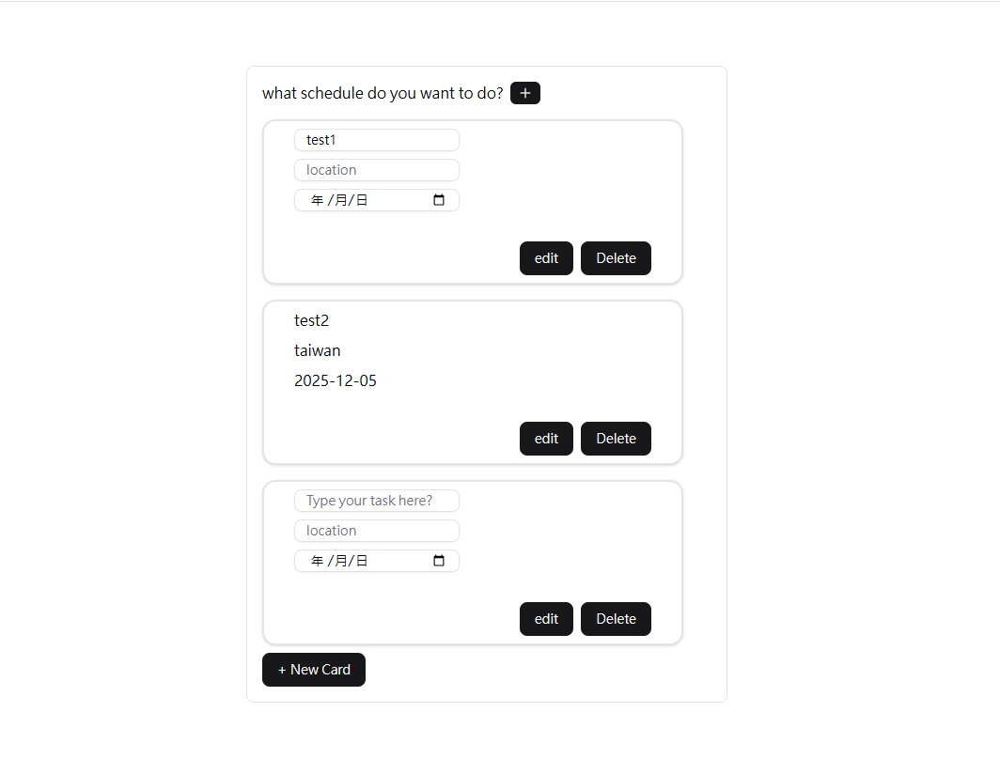

# React Todo (react-todo)

**雙語說明：** 這是一個使用 Next.js + React 打造的待辦事項（Todo）範例應用，內含簡單的佈局、主題切換與可重用 UI 元件。

**Brief (EN):** A small Next.js Todo app example with theme support and reusable UI components.

## Demo



## 主要特色

- **簡單的 Todo 功能**：新增、編輯、切換完成狀態（以組件化方式實作）
- **主題支援**：使用 next-themes 提供深色/淺色主題切換
- **Radix UI & ShadCN 風格元件**：Radix 的 Tooltip / Slot 等小工具，以及可重用的 UI component（src/components）

## 技術棧

- Next.js 16
- React 19
- TypeScript
- Tailwind CSS 4
- Radix UI
- next-themes

## 快速開始（Quick Start）

### 安裝相依套件（Install dependencies）

```bash
npm install
```

### 啟動開發伺服器（Start development server）

專案預設使用 port 3001：

```bash
npm run dev
```

開啟瀏覽器並訪問 [http://localhost:3001](http://localhost:3001) 查看應用。

Open your browser and navigate to [http://localhost:3001](http://localhost:3001) to see the application.

## 可用的腳本（Available Scripts）

在專案目錄中，你可以執行以下命令：

- `npm run dev`: 以開發模式執行應用 (Runs the app in development mode)
- `npm run build`: 為生產環境構建應用 (Builds the app for production)
- `npm run start`: 啟動生產伺服器 (Starts a production server)
- `npm run lint`: 執行程式碼檢查 (Runs the linter)

## 專案結構（Project Structure）

```
src/
 app/              # Next.js app router
    globals.css
    layout.tsx
    page.tsx
 components/       # Reusable React components
    layout/       # Layout components
    providers/    # Context providers
    ui/          # UI component library
 lib/
     utils.ts     # Utility functions
```

## 開發注意事項（Development Notes）

- 使用 TypeScript 進行型別安全開發
- Tailwind CSS 用於樣式設計
- Radix UI 提供可訪問的 UI 元件基礎
- next-themes 管理應用主題狀態

---

**License:** MIT
